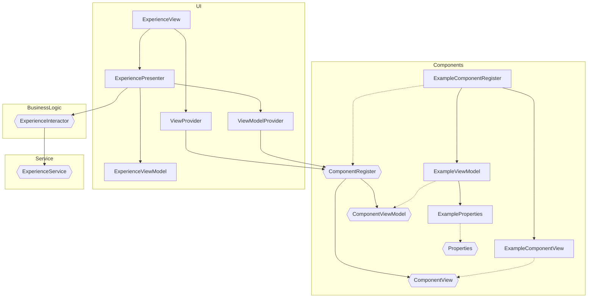

# ExperienceKit

```mermaid

flowchart TD

subgraph Components
    ExampleProperties
    ExampleViewModel
    ExampleComponentView
    ExampleComponentRegister
    
    %% Relationships
    ExampleViewModel-->ExampleProperties
    ExampleProperties-.->Properties{{Properties}}
    ExampleViewModel-.->ComponentViewModel{{ComponentViewModel}}
    ExampleComponentView-.->ComponentView{{ComponentView}}
    ExampleComponentRegister-.->ComponentRegister{{ComponentRegister}}
    ExampleComponentRegister----->ExampleComponentView
    ExampleComponentRegister--->ExampleViewModel
    ComponentRegister{{ComponentRegister}}-->ComponentView{{ComponentView}}
    ComponentRegister{{ComponentRegister}}-->ComponentViewModel{{ComponentViewModel}}
end

subgraph UI
    ExperienceView
    ViewProvider
    ViewModelProvider
    ExperiencePresenter

    %% Relationships
    ViewModelProvider-->ComponentRegister{{ComponentRegister}}
    ViewProvider-->ComponentRegister{{ComponentRegister}}
    ExperienceView-->ViewProvider
    ExperiencePresenter-->ViewModelProvider
    ExperienceView--->ExperiencePresenter
    ExperiencePresenter--->ExperienceViewModel
end

subgraph Service
    ExperienceService{{ExperienceService}}
end

subgraph BusinessLogic
    ExperienceInteractor{{ExperienceInteractor}}
    
    %% Relationships
    ExperienceInteractor{{ExperienceInteractor}}-->ExperienceService{{ExperienceService}}
end

ExperiencePresenter-->ExperienceInteractor

```
