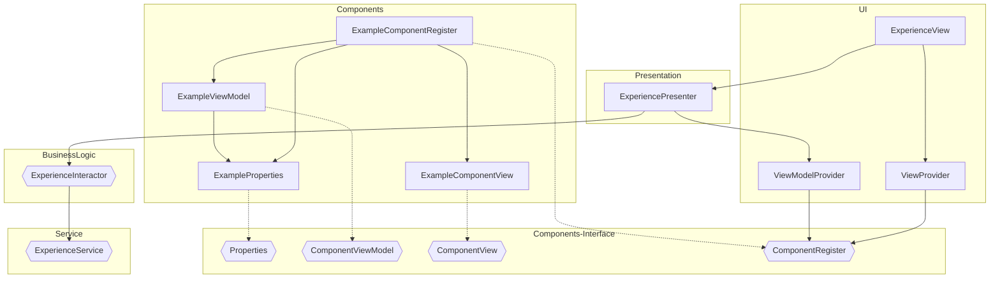

# ExperienceKit

**Architecture**

```mermaid
flowchart TD

subgraph Components-Interface
    Properties{{Properties}}
    ComponentViewModel{{ComponentViewModel}}
    ComponentView{{ComponentView}}
    ComponentRegister{{ComponentRegister}}
end

subgraph Components
    ExampleProperties
    ExampleViewModel
    ExampleComponentView
    ExampleComponentRegister
    
    %% Relationships
    ExampleViewModel-->ExampleProperties
    ExampleProperties-.->Properties{{Properties}}
    ExampleViewModel-.->ComponentViewModel{{ComponentViewModel}}
    ExampleComponentView-.->ComponentView{{ComponentView}}
    ExampleComponentRegister-.->ComponentRegister{{ComponentRegister}}
    ExampleComponentRegister-->ExampleComponentView
    ExampleComponentRegister-->ExampleViewModel
    ExampleComponentRegister-->ExampleProperties
end

subgraph UI
    ExperienceView
    ViewProvider
    ViewModelProvider

    %% Relationships
    ViewModelProvider-->ComponentRegister{{ComponentRegister}}
    ViewProvider-->ComponentRegister{{ComponentRegister}}
    ExperienceView-->ViewProvider
end

subgraph Presentation
    ExperiencePresenter

    %% Relationships
    ExperiencePresenter-->ViewModelProvider
end

ExperienceView-->ExperiencePresenter

subgraph Service
    ExperienceService{{ExperienceService}}
end

subgraph BusinessLogic
    ExperienceInteractor{{ExperienceInteractor}}
    
    %% Relationships
    ExperienceInteractor{{ExperienceInteractor}}-->ExperienceService{{ExperienceService}}
end

ExperiencePresenter-->ExperienceInteractor
```
