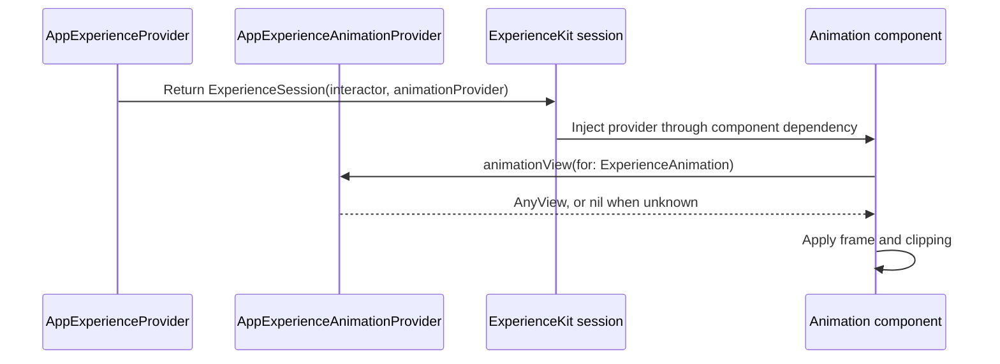

# App Experience Animations

## Purpose

**Principle:**
ExperienceKit has no animation engine. The `animation` component reserves a frame, and the host app supplies the view that plays inside it.

ExperienceKit owns the `ExperienceAnimationProvider` protocol, the component's frame, and clipping. The app owns the concrete provider and decides how each animation is rendered: a Lottie view, a native SwiftUI animation, or anything else. Animation libraries stay dependencies of the app, never of ExperienceKit.

## Core Flow



## Component Contract

`AnimationProperties` mirrors `ImageProperties` and adds `loop`:

```swift
.animationComponent(properties: .init(
    uri: "spinner",
    bundle: Bundle.main.bundleIdentifier ?? "",
    width: 88,       // optional, pt
    height: 88,      // optional, pt
    loop: true       // defaults to true
))
```

**Guidelines:**

- `uri` is a lookup key. ExperienceKit never interprets it; the provider does.
- `bundle` tells the provider where to load an animation file from. A provider that draws natively may ignore it.
- `width` and `height` are applied by ExperienceKit. Leave one `nil` to let that side follow the available space.
- `loop` is passed to the provider on `ExperienceAnimation`. The provider is responsible for honouring it.
- When there is no provider, or it returns `nil`, the component keeps its frame and draws nothing. It never crashes on an unknown `uri`.

## Provider Ownership

**Guidelines:**

- Keep `ExperienceAnimationProvider` as an ExperienceKit protocol.
- Keep the concrete provider, and any animation library it uses, in the app target.
- Hold one provider on `AppExperienceProvider` and pass it to `ExperienceSession` for every screen that shows an animation. A provider with no per-screen state does not need to be created per session.
- Define `uri` values as named constants next to the provider, and use them from interactors instead of repeating raw strings.
- Return views that fill the space they are given. Do not set a fixed size inside the injected view; the component owns the frame.
- Respect Reduce Motion inside the injected view, for example with `@Environment(\.accessibilityReduceMotion)`.

Example provider:

```swift
final class AppExperienceAnimationProvider: ExperienceAnimationProvider {
    enum AnimationURI {
        static let spinner = "spinner"
    }

    func animationView(for animation: ExperienceAnimation) -> AnyView? {
        switch animation.uri {
        case AnimationURI.spinner:
            return AnyView(SpinnerAnimationView(loop: animation.loop))
        default:
            return nil
        }
    }
}
```

Example provider wiring:

```swift
private let animationProvider = AppExperienceAnimationProvider()

case .animationComponent:
    return .init(
        interactor: AnimationComponentInteractor(experienceViewModel: experienceViewModel),
        animationProvider: animationProvider
    )
```

**AI Rule:**
Reject changes that add an animation library to the ExperienceKit package, or that make ExperienceKit interpret an animation `uri` itself.

**AI Rule:**
Flag screens that use `.animationComponent(...)` but whose `ExperienceSession` is created without an `animationProvider`; they render an empty frame.

## Styling Exception

The injected animation view is the one place app-owned SwiftUI drawing is expected inside an ExperienceKit screen. Keep it limited to the animation itself. Layout, text, and controls around it should still be composed from ExperienceKit components as described in [APPEXPERIENCE.md](APPEXPERIENCE.md).
