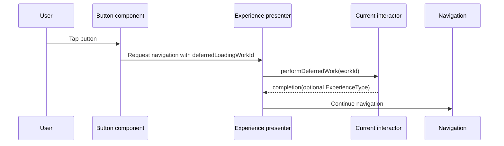

# App Experience Deferred Work

## Purpose

**Principle:**
Deferred work is an interactor-owned intent id. Components can request the work, ExperienceKit routes it, and the interactor performs it before the navigation action completes.

Use deferred work when a component action needs app behavior such as logging, validation, async loading, state capture, or deciding whether to return a replacement `ExperienceType`.

## Ownership

**Guidelines:**

- Define deferred work ids close to the interactor that performs them.
- Prefer a private nested enum that conforms to `DeferredWorkID`.
- Do not create a shared global enum for unrelated screens.
- Avoid raw string literals at call sites once a screen has more than one deferred action.
- Keep one enum case per distinct user intent.

Example:

```swift
private extension PlaygroundGoalUnitsInteractor {
    enum DeferredWork: String, DeferredWorkID {
        case `continue`
    }
}
```

**AI Rule:**
Reject deferred work ids that are declared globally without a real cross-screen contract.

## Button And Navigation Handoff

Attach the work id to the component navigation that should trigger it:

```swift
.buttonComponent(properties: .init(
    title: "Continue",
    style: .primary,
    navigation: .init(
        navigationType: .dismiss,
        deferredLoadingWorkId: DeferredWork.continue,
        experienceViewModel: nil
    )
))
```

The navigation still describes where the user goes. The deferred work id describes what the current interactor should do first.

## `performDeferredWork`

**Guidelines:**

- Decode the incoming id back into the interactor's local enum.
- Return `completion(nil)` for unknown ids.
- Switch over the enum exhaustively.
- Call `completion` exactly once on every path.
- Return `nil` when the work only performs side effects before navigation.
- Return an `ExperienceType` only when the work should replace or load experience content.
- Keep dependency reads, validation, analytics, and logging in this method rather than in component views.

Example:

```swift
func performDeferredWork(workId: any DeferredWorkID, completion: @escaping (ExperienceType?) -> Void) {
    guard let deferredWork = DeferredWork(rawValue: workId.rawValue) else {
        completion(nil)
        return
    }

    switch deferredWork {
    case .continue:
        print("Selected goal: \(selectedValue(for: SelectionKey.goal))")
        print("Selected units: \(selectedValue(for: SelectionKey.units))")
    }

    completion(nil)
}
```

**AI Rule:**
Reject `performDeferredWork` implementations that omit `completion`, rely on untyped string comparisons, or put app side effects in component view models instead of the interactor.

## Sequence



## When Dependencies Are Needed

If deferred work needs app state, inject that state into the interactor when `AppExperienceProvider` creates the session. Do not make ExperienceKit instantiate app state.

For selected component values, use the app-owned selection state pattern in [APPEXPERIENCE_SELECTIONSTATE.md](APPEXPERIENCE_SELECTIONSTATE.md).
