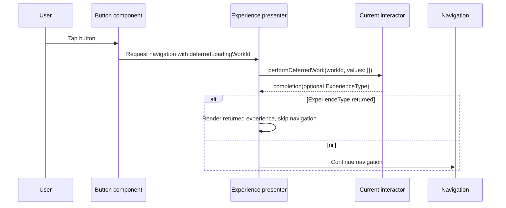
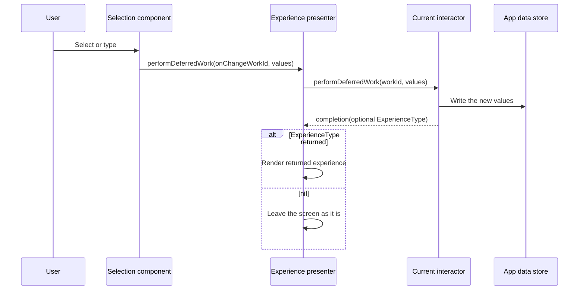

# App Experience Deferred Work

## Purpose

**Principle:**
Deferred work is an interactor-owned intent id. Components can request the work, ExperienceKit routes it, and the interactor performs it.

Use deferred work when a component action needs app behavior such as logging, validation, async loading, state capture, or deciding whether to return a replacement `ExperienceType`.

Components request work in two ways:

| Trigger | Set on | `values` | Loading overlay | Navigates after |
| --- | --- | --- | --- | --- |
| Navigation, such as a button tap | `deferredLoadingWorkId` on the navigation | Empty | Yes | Yes, unless an `ExperienceType` is returned |
| Value change in a selection component | `onChangeWorkId` on the component | The new value or values | No | No |

## Ownership

**Guidelines:**

- Define deferred work ids close to the interactor that performs them.
- Prefer a private nested enum that conforms to `DeferredWorkID`.
- Do not create a shared global enum for unrelated screens.
- Avoid raw string literals at call sites once a screen has more than one deferred action.
- Keep one enum case per distinct user intent.

Example, for a screen whose work carries no values:

```swift
private extension PlaygroundInteractor {
    enum DeferredWork: String, DeferredWorkID {
        case buildMyPlan
    }
}
```

When some of a screen's work carries values, split the ids from the work as shown in [Work That Carries Values](#work-that-carries-values).

**AI Rule:**
Reject deferred work ids that are declared globally without a real cross-screen contract.

## Button And Navigation Handoff

Attach the work id to the component navigation that should trigger it:

```swift
.buttonComponent(properties: .init(
    title: "Continue",
    style: .primary,
    navigation: .init(
        navigationType: .dismiss,
        deferredLoadingWorkId: DeferredWork.continue,
        experienceViewModel: nil
    )
))
```

The navigation still describes where the user goes. The deferred work id describes what the current interactor should do first.

## Value Change Handoff

Selection components report a change with `onChangeWorkId`. The presenter passes the work straight to the interactor: no loading overlay, and no navigation.

```swift
.textfieldComponent(properties: .init(
    label: "Weight",
    placeholder: "88",
    onChangeWorkId: WorkID.weightChanged
))
```

The component's new value arrives in `values`. See [APPEXPERIENCE_SELECTIONSTATE.md](APPEXPERIENCE_SELECTIONSTATE.md#reporting-changes-from-components) for what each component sends.

## Work That Carries Values

**Principle:**
ExperienceKit only knows a work id and a list of strings. The interactor combines the two, once, into an enum whose cases carry their values. The rest of the interactor works with that enum.

A `DeferredWorkID` needs a `String` raw value, so it cannot have associated values, and ExperienceKit could not construct a case of an app enum anyway. Keep the ids in a plain `WorkID` enum and build the typed work from it:

```swift
private extension PlaygroundGoalUnitsInteractor {
    /// The ids components send back. Any value travels separately, in `values`.
    enum WorkID: String, DeferredWorkID {
        case `continue`
        case goalChanged
        case unitsChanged
    }

    /// The work this screen performs. A change carries its new value.
    enum DeferredWork {
        case `continue`
        case goalChanged(String)
        case unitsChanged(String)

        init?(workId: any DeferredWorkID, values: [String]) {
            switch WorkID(rawValue: workId.rawValue) {
            case .continue:
                self = .continue
            case .goalChanged:
                guard let goal = values.first else { return nil }
                self = .goalChanged(goal)
            case .unitsChanged:
                guard let units = values.first else { return nil }
                self = .unitsChanged(units)
            case nil:
                return nil
            }
        }
    }
}
```

**Guidelines:**

- Pass `WorkID` cases to components: `deferredLoadingWorkId: WorkID.continue`, `onChangeWorkId: WorkID.goalChanged`.
- Read `values` only inside `DeferredWork.init?(workId:values:)`. Everywhere else, bind the value from the case: `case .goalChanged(let goal)`.
- Return `nil` from the initializer when a required value is missing, so the work is ignored.
- Use `[String]` as the associated value for multiple selection, and `String` for a single value.
- A screen whose work never carries values keeps the single `DeferredWork: String, DeferredWorkID` enum.

**AI Rule:**
Reject work ids that encode a value in their raw string, and reject interactors that read `values` outside the initializer that builds their typed work.

## `performDeferredWork`

**Guidelines:**

- Decode the incoming id, and its `values` when the work carries any, back into the interactor's local enum.
- Return `completion(nil)` for unknown ids.
- Switch over the enum exhaustively.
- Call `completion` exactly once on every path.
- Return `nil` when the work only performs side effects. Navigation work then continues to its destination; value change work leaves the screen as it is.
- Return an `ExperienceType` only when the work should replace or load experience content. For button navigation this **halts the navigation**: the presenter renders the returned experience on the current screen instead of navigating.
- Return `nil` from text change work. A returned experience rebuilds every component, which drops focus while the user is typing.
- Keep dependency reads, validation, analytics, and logging in this method rather than in component views.
- Delegate work beyond the flow decision itself, such as network calls, persistence, or calculations, to an injected service or data store.

Example:

```swift
func performDeferredWork(workId: any DeferredWorkID, values: [String], completion: @escaping (ExperienceType?) -> Void) {
    guard let deferredWork = DeferredWork(workId: workId, values: values) else {
        completion(nil)
        return
    }

    switch deferredWork {
    case .goalChanged(let goal):
        selectionStateStore.setSelectedValues([goal], for: SelectionKey.goal)
    case .unitsChanged(let units):
        selectionStateStore.setSelectedValues([units], for: SelectionKey.units)
    case .continue:
        print("Selected goal: \(selectedValue(for: SelectionKey.goal))")
        print("Selected units: \(selectedValue(for: SelectionKey.units))")
    }

    completion(nil)
}
```

## Validation Before Navigation

To block navigation until a form is valid, validate in deferred work and return the same screen rebuilt with its error states. Rebuild it from the selection state store so entered values and selections survive the re-render.

```swift
case .continue:
    let missingMeasurements = BodyMeasurement.allCases.filter { !hasEnteredValue(for: $0) }

    guard missingMeasurements.isEmpty else {
        completion(bodyStatsExperience(missingMeasurements: missingMeasurements))
        return
    }
```

Reference: `PlaygroundBodyStatsInteractor`, which renders missing fields with `TextFieldProperties.State.error`, moves focus to the first one with `requestsFocus`, and shows a shared message with `TextProperties.ForegroundStyle.error`.

**AI Rule:**
Reject `performDeferredWork` implementations that omit `completion`, rely on untyped string comparisons, or put app side effects in component view models instead of the interactor.

## Sequence

Navigation work:


```mermaid
sequenceDiagram
    participant User
    participant Component as Button component
    participant Presenter as Experience presenter
    participant Interactor as Current interactor
    participant Router as Navigation

    User->>Component: Tap button
    Component->>Presenter: Request navigation with deferredLoadingWorkId
    Presenter->>Interactor: performDeferredWork(workId, values: [])
    Interactor-->>Presenter: completion(optional ExperienceType)
    alt ExperienceType returned
        Presenter->>Presenter: Render returned experience, skip navigation
    else nil
        Presenter->>Router: Continue navigation
    end
```

Value change work:


```mermaid
sequenceDiagram
    participant User
    participant Component as Selection component
    participant Presenter as Experience presenter
    participant Interactor as Current interactor
    participant Store as App data store

    User->>Component: Select or type
    Component->>Presenter: performDeferredWork(onChangeWorkId, values)
    Presenter->>Interactor: performDeferredWork(workId, values)
    Interactor->>Store: Write the new values
    Interactor-->>Presenter: completion(optional ExperienceType)
    alt ExperienceType returned
        Presenter->>Presenter: Render returned experience
    else nil
        Presenter->>Presenter: Leave the screen as it is
    end
```

## When Dependencies Are Needed

If deferred work needs app state, inject that state into the interactor when `AppExperienceProvider` creates the session. Do not make ExperienceKit instantiate app state.

For services and data stores that perform the work, use the injection pattern in [APPEXPERIENCE_SERVICES.md](APPEXPERIENCE_SERVICES.md).

For selected component values, use the selection state pattern in [APPEXPERIENCE_SELECTIONSTATE.md](APPEXPERIENCE_SELECTIONSTATE.md).
