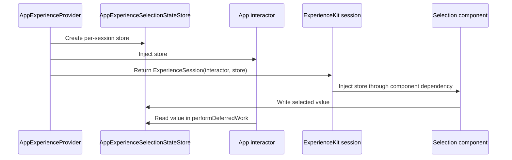

# App Experience Selection State

## Purpose

**Principle:**
Selection state that belongs to an app flow should be implemented by the app, created per experience session, and injected through `ExperienceSession`.

ExperienceKit owns the protocol and component write path. The app owns the concrete store and decides which interactors read from it.

## Core Flow



## Store Ownership

**Guidelines:**

- Keep `ExperienceSelectionStateStore` as an ExperienceKit protocol.
- Keep concrete store implementations in the app target.
- Create a new store instance per experience session that needs selection handoff.
- Pass the same store instance to the interactor and to `ExperienceSession`.
- Do not use a static or process-wide selection store for screen-local flow state.
- Do not make ExperienceKit know about app concrete store types.

Example provider wiring:

```swift
let selectionStateStore = AppExperienceSelectionStateStore()
return .init(
    interactor: PlaygroundGoalUnitsInteractor(
        experienceViewModel: experienceViewModel,
        experienceSelectionStateStore: selectionStateStore
    ),
    selectionStateStore: selectionStateStore
)
```

Example interactor ownership:

```swift
final class PlaygroundGoalUnitsInteractor: ExperienceInteractor {
    private let experienceSelectionStateStore: ExperienceSelectionStateStore

    init(experienceViewModel: ExperienceViewModel?,
         experienceSelectionStateStore: ExperienceSelectionStateStore) {
        self.experienceViewModel = experienceViewModel
        self.experienceSelectionStateStore = experienceSelectionStateStore
    }
}
```

**AI Rule:**
Reject selection state handoff where the interactor reads from a different store instance than the one injected into `ExperienceSession`.

## Component Keys

**Guidelines:**

- Keep selection keys stable and explicit.
- Define keys near the interactor when the interactor reads them.
- For `SelectionCard`, the selection key is its `selectionGroupId` when present.
- For `SegmentedControl`, the selection key is its `accessibilityLabel`.
- Prefer named constants over repeating raw strings.
- Treat key naming as part of the screen contract between the interactor and its components.

Example:

```swift
private extension PlaygroundGoalUnitsInteractor {
    enum SelectionKey {
        static let goal = "playground-goal"
        static let units = "Units"
    }
}
```

## When To Use This Pattern

Use an app-owned selection state store when:

- Multiple component view models produce state that one interactor needs later.
- A button's deferred work needs to read the latest selected values.
- State should live for one rendered experience session.

Do not use this pattern when:

- The state is fully local to one component view model.
- The selected value is only needed to redraw that component.
- The value can be passed directly as component properties.

Component-local state is still appropriate when the behavior stays inside one component view model. The selection state store is for cross-component handoff back to the interactor.

## Reading State In Deferred Work

Read selected values inside `performDeferredWork`, after the user action that commits or advances the screen:

```swift
private func selectedValue(for key: String) -> String {
    experienceSelectionStateStore.selectedValues(for: key).first ?? "nil"
}
```

This keeps component view models responsible for writing state and the interactor responsible for interpreting app flow decisions.

**AI Rule:**
Reject app flow decisions that are made inside selection component view models when the interactor can read the selected values during deferred work.
