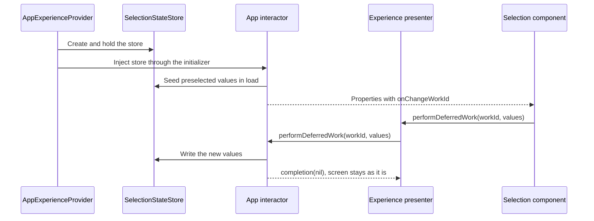

# App Experience Selection State

## Purpose

**Principle:**
Components report what the user selected or typed. The interactor decides what to do with it, and writes it to a store the app owns.

ExperienceKit owns the component and the route back to the interactor. It has no selection store and never sees the app's one. The app owns the store, its keys, and every read and write.

## Core Flow


```mermaid
sequenceDiagram
    participant Provider as AppExperienceProvider
    participant Store as SelectionStateStore
    participant Interactor as App interactor
    participant Presenter as Experience presenter
    participant Component as Selection component

    Provider->>Store: Create and hold the store
    Provider->>Interactor: Inject store through the initializer
    Interactor->>Store: Seed preselected values in load
    Interactor-->>Component: Properties with onChangeWorkId
    Component->>Presenter: performDeferredWork(workId, values)
    Presenter->>Interactor: performDeferredWork(workId, values)
    Interactor->>Store: Write the new values
    Interactor-->>Presenter: completion(nil), screen stays as it is
```

## Reporting Changes From Components

`SelectionCard`, `SegmentedControl`, and `TextField` take an `onChangeWorkId`. When the user changes the value, the component sends that id to the interactor as deferred work, with the new value in `values`.

```swift
.segmentedcontrolComponent(properties: .init(
    options: [
        .init(label: "kg - cm", value: "metric"),
        .init(label: "lb - ft/in", value: "imperial")
    ],
    selectedValue: selectedUnits,
    accessibilityLabel: "Units",
    onChangeWorkId: WorkID.unitsChanged
))
```

| Component | Sends work when | `values` |
| --- | --- | --- |
| `SegmentedControl` | A different segment is selected | The selected option's `value` |
| `TextField` | The text changes | The current text |
| `SelectionCard`, single | A different card is selected | The selected card's `selectionId` |
| `SelectionCard`, multiple | A card is toggled | Every selected `selectionId` in the group, in screen order. Empty when none are selected |

**Guidelines:**

- Give every card in a selection group the same `onChangeWorkId`. `selectionGroupId` still groups the cards so single selection deselects the others.
- Set `selectionId` on every card that reports changes. Without it the card reports a generated UUID.
- Leave `onChangeWorkId` as `nil` when nothing needs the value. The component then keeps its state to itself.
- Components send work only when the value changes. They send nothing when they are created, and nothing when the user reselects the current value.
- `accessibilityLabel`, `label`, and `placeholder` are display copy. They are never used as keys.

**AI Rule:**
Reject components that write selection state to a store, or that are handed a store by ExperienceKit. A component reports a change through `onChangeWorkId` and nothing else.

## Handling Changes In The Interactor

The interactor turns the work id and `values` into its own typed work, then writes to the store. See [Work That Carries Values](APPEXPERIENCE_DEFERREDWORK.md#work-that-carries-values) for the enum pattern.

```swift
func performDeferredWork(workId: any DeferredWorkID, values: [String], completion: @escaping (ExperienceType?) -> Void) {
    guard let deferredWork = DeferredWork(workId: workId, values: values) else {
        completion(nil)
        return
    }

    switch deferredWork {
    case .goalChanged(let goal):
        selectionStateStore.setSelectedValues([goal], for: SelectionKey.goal)
    case .unitsChanged(let units):
        selectionStateStore.setSelectedValues([units], for: SelectionKey.units)
    case .continue:
        // Read the store and act on the answers.
    }

    completion(nil)
}
```

**Guidelines:**

- Complete with `nil` for a change that only needs storing. The screen stays as it is, so a text field keeps focus while the user types.
- Return an `ExperienceType` only when the change should redraw the screen, for example to enable a button. Do not do this for text changes: the presenter rebuilds every component, which drops focus.
- Validate, transform, or ignore a value here before storing it. This is the reason the interactor sits between the component and the store.

**AI Rule:**
Reject app flow decisions that are made inside component view models. The interactor receives the change and decides.

## Seeding Preselected Values

Components report changes, not their starting state. If a screen preselects an option and the user never touches it, no work is sent. The interactor already knows the value it preselected, so it seeds the store in `load`.

```swift
func load(completion: @escaping (ExperienceType) -> Void) {
    let selectedGoal = selectionStateStore.seedSelectedValue(Goal.fatLoss, for: SelectionKey.goal)
    let selectedUnits = selectionStateStore.seedSelectedValue(Units.metric, for: SelectionKey.units)
    // Build the screen with `selectedGoal` and `selectedUnits` preselected.
}
```

`seedSelectedValue(_:for:)` stores the default only when the key has no value, and returns the value now held. The same call therefore restores an earlier choice when the screen is built again.

**AI Rule:**
Flag screens that preselect an option in component properties without seeding the same value in the store. A later screen reads nothing for it.

## Store Ownership

The store is an app data store and follows [APPEXPERIENCE_SERVICES.md](APPEXPERIENCE_SERVICES.md).

**Guidelines:**

- Declare the `SelectionStateStore` protocol and its concrete `AppExperienceSelectionStateStore` in the app target, under `Example/Example/AppExperience/Services/`.
- Inject the store into interactors through the initializer, typed as the protocol.
- Do not pass the store to `ExperienceSession`. ExperienceKit has no use for it.
- Do not use a static or process-wide store for screen-local flow state.

Example interactor ownership:

```swift
final class PlaygroundGoalUnitsInteractor: ExperienceInteractor {
    private let selectionStateStore: SelectionStateStore

    init(experienceViewModel: ExperienceViewModel?,
         selectionStateStore: SelectionStateStore) {
        self.experienceViewModel = experienceViewModel
        self.selectionStateStore = selectionStateStore
    }
}
```

**AI Rule:**
Reject a selection store protocol or implementation declared in `Sources/ExperienceKit/`, and reject `ExperienceSession` or `ExperienceDependency` parameters that carry one.

## Flow-Scoped Stores

**Principle:**
When several screens form one flow and a later screen needs values captured on earlier screens, every interactor in the flow shares one store instance owned by `AppExperienceProvider`.

**Guidelines:**

- Hold the flow store as a private property on `AppExperienceProvider`, named after the flow and typed as `SelectionStateStore`.
- Pass that same instance to each flow screen's interactor.
- Do not create the flow store inside `experienceSession(for:)`. ExperienceKit calls it again whenever SwiftUI re-evaluates the navigation stack, so a store created there loses the flow's values.
- Clear the store in deferred work on the action that starts a new run of the flow, not when a session is created.
- Keep store keys unique across every screen in the flow, because they share one namespace.

Example (Playground onboarding flow):

```swift
private let playgroundFlowSelectionStateStore: SelectionStateStore = AppExperienceSelectionStateStore()

case .playgroundBodyStats:
    return .init(interactor: PlaygroundBodyStatsInteractor(
        experienceViewModel: experienceViewModel,
        selectionStateStore: playgroundFlowSelectionStateStore
    ))
```

`PlaygroundInteractor` clears the store in its `buildMyPlan` deferred work, before pushing the first flow screen.

**AI Rule:**
Reject flow screens that create their own store when a later screen in the same flow reads their values, and reject flow stores that are reset from `experienceSession(for:)`.

## Store Keys

**Guidelines:**

- Keys belong to the app. They identify a value in the store and are never passed to a component.
- Define keys as named constants near the interactor that uses them.
- Prefer named constants over repeating raw strings.
- A screen that reads a value written on an earlier screen uses the same key string.

Example:

```swift
private extension PlaygroundGoalUnitsInteractor {
    enum SelectionKey {
        static let goal = "playground-goal"
        static let units = "Units"
    }
}
```

## When To Use This Pattern

Use `onChangeWorkId` with a store when:

- An interactor needs a selected or entered value later, for example when a button is tapped.
- A later screen in the flow needs the value.
- A re-rendered screen must keep what the user entered.

Do not use it when:

- The state is fully local to one component view model.
- The selected value is only needed to redraw that component.

## Reading State

Read stored values wherever the interactor needs them: in `load` to rebuild a screen, or in deferred work to validate and act.

```swift
private func selectedValue(for key: String) -> String {
    selectionStateStore.selectedValues(for: key).first ?? "nil"
}
```

Reference: `PlaygroundGoalUnitsInteractor` for cards and a segmented control, `PlaygroundBodyStatsInteractor` for text fields and re-rendering with stored values.
