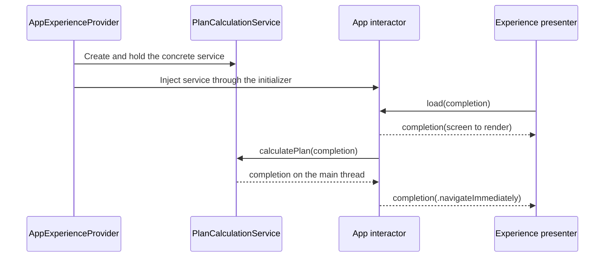

# App Experience Services And Data Stores

## Purpose

**Principle:**
An interactor decides what a screen shows and where the flow goes next. The work behind those decisions (calculations, network calls, persistence, analytics) lives in app-owned services and data stores that are injected into the interactor.

The interactor calls the dependency and turns its result into an `ExperienceType`. It does not contain the work itself.

## Core Flow



## What Belongs Where

| Type | Owns | Examples |
| --- | --- | --- |
| Interactor | Screen composition, flow decisions, mapping results to `ExperienceType` | `PlaygroundCalculatingInteractor` |
| Service | Work and business logic the interactor triggers | `PlanCalculationService`, an API client, analytics |
| Data store | State that is read and written over time | A persisted profile store, a cache |

A service or data store never returns ExperienceKit types such as `Component` or `ExperienceType`, and never navigates. It returns app data; the interactor decides what to do with it.

## Defining A Service Or Data Store

**Guidelines:**

- Declare a protocol named for what the dependency does, such as `PlanCalculationService`.
- Keep the protocol and its concrete implementations in the app target, under `Example/Example/AppExperience/Services/`. Do not add them to `Sources/ExperienceKit/`.
- Prefix the app's concrete implementation with `App`, matching `AppExperienceSelectionStateStore` and `AppExperienceAnimationProvider`.
- Keep timing, endpoints, and other implementation constants inside the concrete type, not in the interactor.
- Call completions on the main thread, and state this on the protocol. The interactor forwards the result straight to the presenter.
- Call the completion exactly once on every path.
- Add the new Swift file to the app target.

Example:

```swift
protocol PlanCalculationService {
    /// Calculates the plan, then calls `completion` on the main thread.
    func calculatePlan(completion: @escaping () -> Void)
}

final class AppPlanCalculationService: PlanCalculationService {
    private let calculationDuration: TimeInterval

    init(calculationDuration: TimeInterval = Timing.calculationDuration) {
        self.calculationDuration = calculationDuration
    }

    func calculatePlan(completion: @escaping () -> Void) {
        DispatchQueue.main.asyncAfter(deadline: .now() + calculationDuration, execute: completion)
    }
}
```

**AI Rule:**
Reject services or data stores that are declared inside `Sources/ExperienceKit/`, that return ExperienceKit component or experience types, or that trigger navigation.

## Injecting Into An Interactor

**Guidelines:**

- Accept each dependency through the interactor initializer and store it as a `private let`.
- Type the stored property as the protocol, never the concrete class.
- Do not create a service inside an interactor, and do not reach for a singleton or static accessor.
- Do not give injected dependencies default values in the interactor initializer. The provider is the only place a concrete type is chosen.
- Inject only what the screen uses.

Example:

```swift
final class PlaygroundCalculatingInteractor: ExperienceInteractor {
    internal let experienceViewModel: ExperienceKit.ExperienceViewModel?
    private let experienceSelectionStateStore: ExperienceSelectionStateStore
    private let planCalculationService: PlanCalculationService

    init(experienceViewModel: ExperienceKit.ExperienceViewModel?,
         experienceSelectionStateStore: ExperienceSelectionStateStore,
         planCalculationService: PlanCalculationService) {
        self.experienceViewModel = experienceViewModel
        self.experienceSelectionStateStore = experienceSelectionStateStore
        self.planCalculationService = planCalculationService
    }
}
```

**AI Rule:**
Reject interactors that perform async work, delays, networking, persistence, or business calculations inline. Move the work into an injected service or data store.

**AI Rule:**
Reject interactors that instantiate their own services, read them from a singleton, or store them as a concrete type.

## Provider Wiring

`AppExperienceProvider` is the composition root. It creates the concrete dependency and passes it to every interactor that needs it.

```swift
private let planCalculationService: PlanCalculationService = AppPlanCalculationService()

case .playgroundCalculating:
    return .init(
        interactor: PlaygroundCalculatingInteractor(
            experienceViewModel: experienceViewModel,
            experienceSelectionStateStore: playgroundFlowSelectionStateStore,
            planCalculationService: planCalculationService
        ),
        selectionStateStore: playgroundFlowSelectionStateStore,
        animationProvider: animationProvider
    )
```

**Guidelines:**

- Hold services and data stores as private properties on `AppExperienceProvider`, typed as their protocol.
- Do not create a stateful dependency inside `experienceSession(for:)`. ExperienceKit calls it again whenever SwiftUI re-evaluates the navigation stack, so state created there is lost or split.
- Share one instance between interactors that must see the same data.
- Services and data stores are injected into the interactor only. `ExperienceSession` carries the dependencies ExperienceKit hands to component view models (`selectionStateStore`, `animationProvider`); app services do not go through it.

**AI Rule:**
Flag concrete service types that are named anywhere outside `AppExperienceProvider` and the service's own file.

## Calling A Dependency

Call the dependency from `load(completion:)` or `performDeferredWork(workId:completion:)`, then map its result to the completion.

```swift
func load(completion: @escaping (ExperienceType) -> Void) {
    completion(.fullScreen(properties: calculatingScreen()))

    planCalculationService.calculatePlan {
        completion(.navigateImmediately(navigationViewModel: .init(
            navigationType: .push(Experience.playgroundPlanReveal),
            deferredLoadingWorkId: nil,
            experienceViewModel: .init(searchBar: nil, navigationBar: nil))))
    }
}
```

**Guidelines:**

- Render the screen before starting work that should not block it. See [Navigating Without A User Action](APPEXPERIENCE.md#navigating-without-a-user-action).
- Call the interactor's completion exactly once per result the service delivers.
- Keep presentation concerns in the interactor: copy, component layout, and the choice of next `Experience`.

## Selection State Stores

`ExperienceSelectionStateStore` is the one data store whose protocol lives in ExperienceKit, because component view models write to it. It follows its own rules in [APPEXPERIENCE_SELECTIONSTATE.md](APPEXPERIENCE_SELECTIONSTATE.md). Every other service and data store is declared and implemented in the app target as described here.

Reference: `PlanCalculationService`, `AppPlanCalculationService`, and `PlaygroundCalculatingInteractor`.
